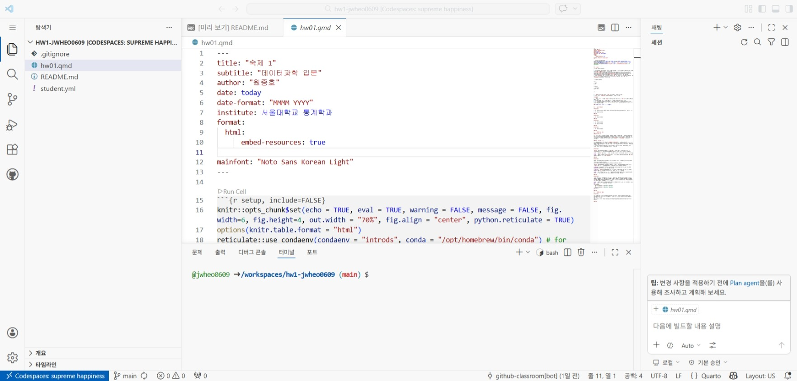

```{r setup, include=FALSE}
knitr::opts_chunk$set(echo = TRUE, eval = TRUE, warning = FALSE, message = FALSE, fig.width=6, fig.height=4, out.width = "70%", fig.align = "center", python.reticulate = TRUE)  
options(knitr.table.format = "html")
reticulate::use_condaenv(condaenv = "introds", conda = "C:/Users/LG/anaconda3/Scripts/conda.exe")# for persistency
```

## 지시사항

제출마감 2026-04-15 23:00

1.  R과 Python을 모두 사용하여 사용된 코드와 데이터랭글링 절차, 분석결과를 설명한다. 두 언어의 분석결과가 차이가 있으면 그 이유를 설명한다.
2.  [Quarto Markdown](https://quarto.org/docs/authoring/markdown-basics.html)을 사용한다. 제공된 숙제 `.qmd` 파일에 본인의 답안을 "답안" 절에 추가하여 제출한다. Quarto Markdown은 RStudio 또는 Visual Studio Code에 [Quarto Extension](https://marketplace.visualstudio.com/items?itemName=quarto.quarto)을 추가하여 컴파일, 다른 문서 형식으로 변환할 수 있다.
3.  R의 `reticulate` 패키지를 사용하면 하나의 `.qmd` 파일 안에서 R과 Python을 동시에 사용할 수 있다. 이때 다음 문법을 사용하여 두 언어 코드를 탭으로 구분한다. 숙제 `.qmd` 파일은 `reticulate`을 사용하도록 준비되어 있다.

        
::: {.panel-tabset}

## R

```{r}
# install.packages("mdsr")
# install.packages("tidyverse")
# install.packages("NHANES")
# install.packages("macleish")
# install.packages("devtools")
# devtools::install_github("haleyjeppson/ggmosaic")
# install.packages("tidygraph")
# install.packages("babynames")
# install.packages("lubridate")
# install.packages("Lahman")
library("mdsr")
library("tidyverse")
library("NHANES")
library("macleish")
library("ggmosaic")
library("ggraph")
library("tidygraph")
library("babynames")
library("lubridate")
library("Lahman")
library("nycflights13")
library("knitr")
library("googlesheets4")
library("rvest")

sessionInfo()
```

## Python

```{python}
# conda install pandas
# conda install matplotlib
# conda install numpy 
# conda install scikit-learn
# conda install plotnine
# conda install seaborn
# conda install pyarrow
# conda install polars
# conda install geopandas
# conda install networkx
# conda install wquantiles
import sys
import pandas as pd
import polars as pl
import matplotlib.pyplot as plt
import numpy as np
import seaborn as sns
from plotnine import *
import geopandas
import networkx
import wquantiles
import session_info
import requests
import io
import pylahman
import zipfile
from datetime import datetime
from bs4 import BeautifulSoup

import warnings
warnings.filterwarnings('ignore')

print(sys.version)
session_info.show()
```

:::


3.  `.qmd`를 컴파일하여 생성된 `.html` 파일을 함께 저장소에 제출한다.
4.  함께 제공된 `student.yml`을 함께 작성하여 저장소에 제출한다.

## 평가 기준

1.  재현성: 제출된 저장소의 `.qmd` 파일을 컴파일하여 함께 제출된 `.html` 파일과 동일한 결과가 나와야 한다.
2.  분석의 정확성: 분석은 올바른 기술적 세부 사항을 포함하여 수행되어야 한다.
3.  보고서의 전반적인 품질: 데이터 가공 및 분석 결과가 명확하고 자세하게 설명되어야 한다.
4.  코드의 전반적인 품질: 코드는 체계적으로 정리되어 있어야 하며, 가독성을 높이기 위해 적절한 주석이 포함되어야 한다.

#### **늦게 제출된 과제물은 받지 않는다.**

# 1부 교과서 연습문제

## 문제 1-1

1.  2장 연습문제 2.7.2. "Making better inferences from statistical graphics"를 대상으로 할 것.

2.  2장 연습문제 2.7.6

### 답안

::: {.panel-tabset}

## R(Problem 2.7.2)

```{r}
cat(r'(
Pick one of the Science Notebook entries at https://www.edwardtufte.com/tufte (e.g., “Making better inferences from statistical graphics”). Write a brief reflection on the graphical principles that are illustrated by this entry.

1. 인과관계의 명확한 제시 (Show Causality)
터프티는 훌륭한 그래픽은 단순한 상관관계를 보여주는 데 그치지 않고, 변수 간의 인과적 메커니즘을 추론할 수 있도록 도와야 한다고 주장합니다. 데이터 사이의 논리적 연결 고리를 시각적으로 드러냄으로써, 보는 이가 "왜 이런 결과가 나왔는가?"에 대한 답을 찾을 수 있게 합니다.

2. 다변량 데이터의 통합 (Multivariate Analysis)
현실의 문제는 결코 하나의 변수로 설명되지 않습니다. 터프티는 적어도 3개 이상의 변수를 한 화면에 통합하여 보여줄 것을 권장합니다. 이를 통해 복잡한 현상의 맥락을 유지하면서도 데이터의 풍부함을 잃지 않는 분석적 사고를 유도합니다.

3. 비교의 원칙 (Comparisons)
"무엇과 비교해서?"라는 질문은 통계적 추론의 핵심입니다. 터프티는 그래픽 내에서 서로 다른 조건, 그룹, 또는 시간대별 데이터를 직접적으로 비교할 수 있는 구조를 갖추어야 한다고 강조합니다. 비교 대상이 명확할 때 데이터의 의미(차이, 패턴)가 선명하게 드러나기 때문입니다.

4. 텍스트, 숫자, 이미지의 통합 (Integration of Evidence)
터프티는 "데이터 잉크(Data-Ink)"의 효율성을 극대화하기 위해 글자, 숫자, 그림을 분리하지 말고 하나의 유기적인 흐름으로 결합하라고 조언합니다. 설명 문구가 그래프와 멀리 떨어져 있으면 시선이 분산되어 추론의 흐름이 끊기기 때문입니다. 모든 증거는 한눈에 들어오는 범위 내에 집약되어야 합니다.

5. 높은 정보 밀도와 스파크라인 (High Information Density)
그는 넓은 공간에 적은 데이터를 담는 것을 지극히 경계합니다. 오히려 좁은 공간에 많은 양의 데이터를 정교하게 배치함으로써(예: 스파크라인), 시각적 직관과 정밀한 분석을 동시에 만족시켜야 한다고 봅니다.

6. 내용의 우선순위 (Content-Responsive Design)
그래픽의 디자인은 항상 **데이터의 내용(Content)**을 따라가야 합니다. 장식적인 요소(Chartjunk)를 제거하고, 데이터 자체가 스스로 이야기하게 만드는 것이 터프티가 추구하는 미니멀리즘과 분석적 디자인의 정수입니다.

요약 및 성찰
터프티의 원칙을 관통하는 핵심은 **"그래픽은 사고를 돕는 도구여야 한다"**는 것입니다. 예쁘게 그리는 것이 목적이 아니라, 보는 사람이 데이터를 통해 가장 정확하고 깊이 있는 결론에 도달하도록 돕는 '분석적 정직함'이 가장 중요한 원칙임을 이 글은 시사하고 있습니다.
)')
```

## Python(Problem 2.7.2)

```{python}
print('''
Pick one of the Science Notebook entries at https://www.edwardtufte.com/tufte (e.g., “Making better inferences from statistical graphics”). Write a brief reflection on the graphical principles that are illustrated by this entry.

1. 인과관계의 명확한 제시 (Show Causality)
터프티는 훌륭한 그래픽은 단순한 상관관계를 보여주는 데 그치지 않고, 변수 간의 인과적 메커니즘을 추론할 수 있도록 도와야 한다고 주장합니다. 데이터 사이의 논리적 연결 고리를 시각적으로 드러냄으로써, 보는 이가 "왜 이런 결과가 나왔는가?"에 대한 답을 찾을 수 있게 합니다.

2. 다변량 데이터의 통합 (Multivariate Analysis)
현실의 문제는 결코 하나의 변수로 설명되지 않습니다. 터프티는 적어도 3개 이상의 변수를 한 화면에 통합하여 보여줄 것을 권장합니다. 이를 통해 복잡한 현상의 맥락을 유지하면서도 데이터의 풍부함을 잃지 않는 분석적 사고를 유도합니다.

3. 비교의 원칙 (Comparisons)
"무엇과 비교해서?"라는 질문은 통계적 추론의 핵심입니다. 터프티는 그래픽 내에서 서로 다른 조건, 그룹, 또는 시간대별 데이터를 직접적으로 비교할 수 있는 구조를 갖추어야 한다고 강조합니다. 비교 대상이 명확할 때 데이터의 의미(차이, 패턴)가 선명하게 드러나기 때문입니다.

4. 텍스트, 숫자, 이미지의 통합 (Integration of Evidence)
터프티는 "데이터 잉크(Data-Ink)"의 효율성을 극대화하기 위해 글자, 숫자, 그림을 분리하지 말고 하나의 유기적인 흐름으로 결합하라고 조언합니다. 설명 문구가 그래프와 멀리 떨어져 있으면 시선이 분산되어 추론의 흐름이 끊기기 때문입니다. 모든 증거는 한눈에 들어오는 범위 내에 집약되어야 합니다.

5. 높은 정보 밀도와 스파크라인 (High Information Density)
그는 넓은 공간에 적은 데이터를 담는 것을 지극히 경계합니다. 오히려 좁은 공간에 많은 양의 데이터를 정교하게 배치함으로써(예: 스파크라인), 시각적 직관과 정밀한 분석을 동시에 만족시켜야 한다고 봅니다.

6. 내용의 우선순위 (Content-Responsive Design)
그래픽의 디자인은 항상 데이터의 내용(Content)을 따라가야 합니다. 장식적인 요소(Chartjunk)를 제거하고, 데이터 자체가 스스로 이야기하게 만드는 것이 터프티가 추구하는 미니멀리즘과 분석적 디자인의 정수입니다.

요약 및 성찰
터프티의 원칙을 관통하는 핵심은 "그래픽은 사고를 돕는 도구여야 한다"는 것입니다. 예쁘게 그리는 것이 목적이 아니라, 보는 사람이 데이터를 통해 가장 정확하고 깊이 있는 결론에 도달하도록 돕는 '분석적 정직함'이 가장 중요한 원칙임을 이 글은 시사하고 있습니다.
''')
```

:::

::: {.panel-tabset}

## R(Problem 2.7.6)

```{r}
cat(r'(
Consider the data graphic http://tinyurl.com/nytimes-unplanned about birth control methods.

a. What quantity is being shown on the  y-axis of each plot?
  y축은 10년 동안 해당 방법을 지속적으로 사용했을 때 임신할 확률을 누적으로 백분율로 표현합니다.

b. List the variables displayed in the data graphic, along with the units and a few typical values for each.
  1. 시간(Time)
    - 단위: 년(Years)
    - 값: 1년에서 10년 사이의 정수(예: 1, 5, 10년)

  2.피임 방법 (Contraceptive Method):
    - 단위: 범주형(Category)
    - 값: 경구 피임약(Pill), 콘돔(Condom), IUD(자궁 내 장치), 임플란트(Implant), 살정제(Spermicide) 등

  3. 사용 방식의 엄격함(Usage Type)
    - 단위: 범주형(Binary)
    - 값: 일반적인 사용(Typical use), 완벽한 사용(Perfect use)

  4. 임신 확률 (Probability of Pregnancy):
    - 단위: 백분율(%)
    - 값: 0% ~ 100%

c. List the visual cues used in the data graphic and explain how each visual cue is linked to each variable.
  1. 위치 (Position - 수직/수평):
    수평 위치(x축): 시간을 나타냅니다. 오른쪽으로 갈수록 시간이 경과함을 의미합니다.
    수직 위치(y축): 임신 확률을 나타냅니다. 위로 갈수록 임신 가능성이 높음을 의미합니다.

  2. 선과 면적(Lines and Areas): 시간에 따른 누적 확률의 변화를 보여주며, typical use와 perfect use 사이의 간격을 면적으로 채워 두 방식의 효과 차이(Gap)를 시각화합니다.

  3. 색상(Color): 피임 방법의 효과성에 따라 색상을 구분합니다. 효과가 높은 방법(IUD 등)은 대개 차분하거나 짙은 색, 효과가 낮은 방법은 경고의 의미를 담은 다른 색조를 사용하거나 선의 밀도를 다르게 표현합니다.

  4. 텍스트 라벨 (Text Labels): 각 그래프 옆에 피임 방법의 명칭을 직접 표기하여 범주형 변수를 식별하게 합니다.

d. Examine the graphic carefully. Describe, in words, what information you think the data graphic conveys. Do not just summarize the data—interpret the data in the context of the problem and tell us what it means. (Note: information is meaningful to human beings—it is not the same thing as data.)

  이 그래픽은 단순히 "어떤 피임약이 좋다"는 수치를 보여주는 것을 넘어, "인간의 실수(Human Error)가 피임의 성공 여부에 얼마나 결정적인 영향을 미치는가"를 시각적으로 웅변하고 있습니다.

  실수의 대가: 완벽한 사용과 일반적인 사용 사이의 간격이 넓은 방법(예: 콘돔, 피임약)은 사용자가 복용 잊음이나 착용 미숙 등 사소한 실수를 할 때 임신 위험이 기하급수적으로 높아짐을 의미합니다.

  지속성의 공포: 1년 단위로 보면 낮아 보이는 실패율(예: 3~9%)도 10년이라는 장기적인 관점에서 누적하면 매우 높은 확률로 임신할 수 있습습니다.

  결론적 메시지: 사용자의 의지나 기억력에 의존해야 하는 방법(Pill, Condom)보다, 한 번의 시술로 사용자의 개입이 불필요한 방법(IUD, Implant)이 장기적으로 훨씬 안전하고 신뢰할 수 있다는 행동 지침을 사용자에게 전달하고 있습니다. 즉, "피임의 효과는 제품의 성능뿐만 아니라, 사용의 편의성과 지속성에 달려 있다"는 것이 이 그래픽의 핵심 정보입니다.)')
```

## Python(Problem 2.7.6)

```{python}
print('''
Consider the data graphic http://tinyurl.com/nytimes-unplanned about birth control methods.

a. What quantity is being shown on the  y-axis of each plot?
  y축은 10년 동안 해당 방법을 지속적으로 사용했을 때 임신할 확률을 누적으로 백분율로 표현합니다.

b. List the variables displayed in the data graphic, along with the units and a few typical values for each.
  1. 시간(Time)
    - 단위: 년(Years)
    - 값: 1년에서 10년 사이의 정수(예: 1, 5, 10년)
  
  2.피임 방법 (Contraceptive Method):
    - 단위: 범주형(Category)
    - 값: 경구 피임약(Pill), 콘돔(Condom), IUD(자궁 내 장치), 임플란트(Implant), 살정제(Spermicide) 등
  
  3. 사용 방식의 엄격함(Usage Type)
    - 단위: 범주형(Binary)
    - 값: 일반적인 사용(Typical use), 완벽한 사용(Perfect use)
  
  4. 임신 확률 (Probability of Pregnancy):
    - 단위: 백분율(%)
    - 값: 0% ~ 100%

c. List the visual cues used in the data graphic and explain how each visual cue is linked to each variable.
  1. 위치 (Position - 수직/수평):
    수평 위치(x축): '시간'을 나타냅니다. 오른쪽으로 갈수록 시간이 경과함을 의미합니다.
    수직 위치(y축): '임신 확률'을 나타냅니다. 위로 갈수록 임신 가능성이 높음을 의미합니다.
  
  2. 선과 면적 (Lines and Areas): 시간에 따른 누적 확률의 변화를 보여주며, '일반적 사용'과 '완벽한 사용' 사이의 간격을 면적으로 채워 두 방식의 효과 차이(Gap)를 시각화합니다.
  
  3. 색상 (Color): 피임 방법의 '효과성'에 따라 색상을 구분합니다. 효과가 높은 방법(IUD 등)은 대개 차분하거나 짙은 색, 효과가 낮은 방법은 경고의 의미를 담은 다른 색조를 사용하거나 선의 밀도를 다르게 표현합니다.
  
  4. 텍스트 라벨 (Text Labels): 각 그래프 옆에 '피임 방법의 명칭'을 직접 표기하여 범주형 변수를 식별하게 합니다.

d. Examine the graphic carefully. Describe, in words, what information you think the data graphic conveys. Do not just summarize the data—interpret the data in the context of the problem and tell us what it means. (Note: information is meaningful to human beings—it is not the same thing as data.)

  이 그래픽은 단순히 "어떤 피임약이 좋다"는 수치를 보여주는 것을 넘어, "인간의 실수(Human Error)가 피임의 성공 여부에 얼마나 결정적인 영향을 미치는가"를 시각적으로 웅변하고 있습니다.
  
  실수의 대가: '완벽한 사용'과 '일반적인 사용' 사이의 간격이 넓은 방법(예: 콘돔, 피임약)은 사용자가 복용 잊음이나 착용 미숙 등 사소한 실수를 할 때 임신 위험이 기하급수적으로 높아짐을 의미합니다.
  
  지속성의 공포: 1년 단위로 보면 낮아 보이는 실패율도 10년이라는 장기적인 관점에서 누적하면 매우 높은 확률로 임신에 도달하게 된다는 '누적의 위험성'을 경고합니다.
  
  결론적 메시지: 사용자의 의지나 기억력에 의존해야 하는 방법(Pill, Condom)보다, 한 번의 시술로 사용자의 개입이 불필요한 방법(IUD, Implant)이 장기적으로 훨씬 안전하고 신뢰할 수 있다는 '행동 지침'을 사용자에게 전달하고 있습니다. 즉, "피임의 효과는 제품의 성능뿐만 아니라, 사용의 편의성과 지속성에 달려 있다"는 것이 이 그래픽의 핵심 정보입니다.

''')
```

:::

## 문제 1-2

1.  3장 연습문제 3.5.4

### 답안

::: {.panel-tabset}

## R(Problem 3.5.4)

```{r}
# 필요한 패키지 불러오기
library(tidyverse)
library(macleish)

# 데이터 시각화
ggplot(data = whately_2015, aes(x = when, y = temperature)) +
  geom_line(color = "steelblue", alpha = 0.6) +
  labs(
    title = "2015년 매사추세츠주 훼틀리(Whately)의 시간에 따른 온도 변화",
    x = "시간 (Time)",
    y = "온도 (Temperature, °C)"
  ) +
  theme_minimal()
```

## Python(Problem 3.5.4)

```{python}
import pandas as pd
import matplotlib.pyplot as plt

# 데이터가 csv 파일로 저장되어 있다고 가정한 불러오기 예시:
whately_2015 = pd.read_csv('whately_2015.csv')

# 'when' 열을 datetime(날짜시간) 객체로 변환 (이미 되어있다면 생략 가능)
whately_2015['when'] = pd.to_datetime(whately_2015['when'])

# 그래프 크기 설정
plt.figure(figsize=(10, 6))

# 선 그래프 그리기 (x축: 시간, y축: 온도)
plt.plot(whately_2015['when'], whately_2015['temperature'], color='steelblue', alpha=0.6)

# 그래프 제목 및 축 라벨 설정
plt.title('2015년 매사추세츠주 훼틀리(Whately)의 시간에 따른 온도 변화')
plt.xlabel('시간 (Time)')
plt.ylabel('온도 (Temperature, °C)')

# R의 theme_minimal()과 유사하게 깔끔한 격자선 추가
plt.grid(True, linestyle='--', alpha=0.7)

# x축 날짜 라벨이 겹치지 않도록 45도 회전
plt.xticks(rotation=45)

# 레이아웃이 잘리지 않도록 자동 조정
plt.tight_layout()

# 그래프 출력
plt.show()
```

:::

## 문제 1-3

1.  4장 연습문제 4.4.8

2.  4장 연습문제 4.4.13

### 답안

::: {.panel-tabset}

## R(Problem 4.4.8)

```{r}
# 필요한 패키지 불러오기
library(tidyverse)
library(Lahman)

# 1. 데이터 가공 및 장타율(SLG) 계산
teams_slg <- Teams %>%
  # 1954년 이후, 그리고 AL(아메리칸 리그)과 NL(내셔널 리그)만 필터링
  filter(yearID >= 1954, lgID %in% c("AL", "NL")) %>%
  # 연도와 리그별로 그룹화하여 데이터 합산
  group_by(yearID, lgID) %>%
  summarize(
    total_AB = sum(AB, na.rm = TRUE),
    total_H = sum(H, na.rm = TRUE),
    total_X2B = sum(X2B, na.rm = TRUE), # Lahman 패키지에서 2루타는 X2B (또는 `2B`)
    total_X3B = sum(X3B, na.rm = TRUE), # 3루타는 X3B (또는 `3B`)
    total_HR = sum(HR, na.rm = TRUE),
    .groups = 'drop'
  ) %>%
  mutate(
    # 단타(Single) = 전체 안타 - 2루타 - 3루타 - 홈런
    total_1B = total_H - total_X2B - total_X3B - total_HR,
    
    # 총 루타수(Total Bases) = 단타 + (2루타 * 2) + (3루타 * 3) + (홈런 * 4)
    TB = total_1B + (2 * total_X2B) + (3 * total_X3B) + (4 * total_HR),
    
    # 장타율(Slugging Percentage) = 총 루타수 / 총 타수
    SLG = TB / total_AB 
  )

# 2. 결과 시각화
ggplot(teams_slg, aes(x = yearID, y = SLG, color = lgID)) +
  geom_line(size = 1) +
  geom_point(size = 2, alpha = 0.7) +
  scale_color_manual(values = c("AL" = "#D50032", "NL" = "#002D72")) + # 리그 상징색 적용
  labs(
    title = "1954년 이후 아메리칸 리그(AL) vs 내셔널 리그(NL) 장타율 변화",
    x = "연도 (Year)",
    y = "장타율 (Slugging Percentage, SLG)",
    color = "리그 (League)"
  ) +
  theme_minimal()
```

## Python(Problem 4.4.8)

```{python}
import pandas as pd
import seaborn as sns
import matplotlib.pyplot as plt

# 1. 데이터 불러오기
_Teams = pylahman.Teams()
teams = pl.from_pandas(_Teams)

# 2. 데이터 필터링 및 장타율(SLG) 계산
# 1954년 이후, 아메리칸 리그(AL)와 내셔널 리그(NL) 데이터만 선택
teams_filtered = teams.filter((teams['yearID'] >= 1954) & (teams['lgID'].is_in(['AL', 'NL'])))

# 2. 1루타(Single) 계산
# Teams 데이터에는 H(총 안타), 2B(2루타), 3B(3루타), HR(홈런)이 있습니다.
# 1루타 = 총 안타 - (2루타 + 3루타 + 홈런)
teams_filtered = teams_filtered.with_columns(
    (teams_filtered['H'] - (teams_filtered['2B'] + teams_filtered['3B'] + teams_filtered['HR'])).alias("1B")
)

# 3. 총 루타(Total Bases, TB) 계산
# TB = (1루타 * 1) + (2루타 * 2) + (3루타 * 3) + (홈런 * 4)
teams_filtered = teams_filtered.with_columns((
      (teams_filtered['1B'] * 1) + \
      (teams_filtered['2B'] * 2) + \
      (teams_filtered['3B'] * 3) + \
      (teams_filtered['HR'] * 4)).alias("TB")
)

# 4. 장타율(Slugging Percentage, SLG) 계산
# SLG = 총 루타(TB) / 타수(AB)
teams_filtered = teams_filtered.with_columns((teams_filtered['TB'] / teams_filtered['AB']).alias("SLG"))

# 5. 그래프 시각화 (연도별 SLG 추세를 리그별로 분리해서 표시)
plt.figure(figsize=(12, 6))

# seaborn의 lineplot을 사용하면 같은 연도의 여러 팀 데이터의 평균과 신뢰구간을 함께 보여줍니다.
sns.lineplot(data=teams_filtered, x='yearID', y='SLG', hue='lgID', marker='o')

plt.title('Slugging Percentage (SLG) by Year since 1954 (AL vs NL)', fontsize=14)
plt.xlabel('Year', fontsize=12)
plt.ylabel('Slugging Percentage (SLG)', fontsize=12)
plt.legend(title='League', loc='upper left')
plt.grid(True, linestyle='--', alpha=0.7)

# 그래프 출력
plt.show()
```

:::

::: {.panel-tabset}

## R(Problem 4.4.13)

```{r}
# 필요한 패키지 불러오기
library(tidyverse)
library(Lahman)

# 1. 에인절스의 역대 최고 승률 10개 시즌 추출
angels_top10 <- Teams %>%
  # 에인절스의 teamID 필터링
  filter(teamID %in% c("CAL", "ANA", "LAA")) %>%
  # 정규시즌 승률(WinPct) 계산: 승리(W) / 전체 경기 수(G)
  mutate(WinPct = W / G) %>%
  # 요구된 변수들과 계산된 승률 선택
  select(yearID, teamID, lgID, W, L, WSWin, WinPct) %>%
  # 승률을 기준으로 내림차순 정렬
  arrange(desc(WinPct)) %>%
  # 상위 10개 행 추출
  head(10)

# 결과 출력
print(angels_top10)
```

## Python(Problem 4.4.13)

```{python}
import pandas as pd
import seaborn as sns
import matplotlib.pyplot as plt
import pylahman

# 1. 데이터 불러오기
_Teams = pylahman.Teams()
Teams = pl.from_pandas(_Teams)

print("="*50)
print("문제 8: AL vs NL 장타율(SLG) 비교 (1954년 이후)")
print("="*50)

# 조건에 맞는 데이터 필터링 및 파생 변수(1B, TB, SLG) 생성
slg_df = (
    Teams.filter(
        (pl.col('yearID') >= 1954) & (pl.col('lgID').is_in(['AL', 'NL']))
    )
    .with_columns(
        # 1루타 = 안타 - (2루타 + 3루타 + 홈런)
        (pl.col('H') - pl.col('2B') - pl.col('3B') - pl.col('HR')).alias('1B')
    )
    .with_columns(
        # 총 루타 = 1루타 + 2*2루타 + 3*3루타 + 4*홈런
        (pl.col('1B') + pl.col('2B') * 2 + pl.col('3B') * 3 + pl.col('HR') * 4).alias('TB')
    )
    .with_columns(
        # 장타율 = 총 루타 / 타수
        (pl.col('TB') / pl.col('AB')).alias('SLG')
    )
)

# 시각화를 위해 seaborn을 사용하며, 이 때는 pandas로 다시 변환해 주는 것이 편리합니다.
plt.figure(figsize=(12, 6))
sns.lineplot(data=slg_df.to_pandas(), x='yearID', y='SLG', hue='lgID', marker='o')
plt.title('Slugging Percentage (SLG) by Year since 1954 (AL vs NL)', fontsize=14)
plt.xlabel('Year')
plt.ylabel('Slugging Percentage (SLG)')
plt.legend(title='League')
plt.grid(True, linestyle='--', alpha=0.7)
plt.show()

print("\n")
print("="*50)
print("문제 13: 에인절스 역대 최고 승률 시즌 및 월드시리즈 우승")
print("="*50)

# 에인절스 팀 필터링 및 승률(Win_Pct) 계산
angels_df = (
    Teams.filter(
        pl.col('teamID').is_in(['CAL', 'ANA', 'LAA'])
    )
    .with_columns(
        (pl.col('W') / (pl.col('W') + pl.col('L'))).alias('Win_Pct')
    )
)

# 1. 역대 최고 승률 Top 10 추출
# sort 메서드에서 descending=True 를 사용하여 내림차순 정렬합니다.
top_10_angels = (
    angels_df.sort('Win_Pct', descending=True)
    .head(10)
    .select(['yearID', 'teamID', 'lgID', 'W', 'L', 'WSWin', 'Win_Pct'])
)

print("--- 역대 에인절스 최고 승률 시즌 Top 10 ---")
print(top_10_angels)

# 2. 월드시리즈 우승 여부 확인
ws_winners = (
    angels_df.filter(pl.col('WSWin') == 'Y')
    .select(['yearID', 'teamID', 'W', 'L', 'WSWin'])
)

print("\n--- 월드시리즈 우승 시즌 ---")
if ws_winners.height > 0: # polars에서는 row 개수를 확인할 때 height를 사용합니다.
    print(ws_winners)
else:
    print("월드시리즈 우승 기록이 없습니다.")
```

:::

## 문제 1-4

1.  5장 연습문제 5.5.5

### 답안

::: {.panel-tabset}

## R(Problem 5.5.5)

```{r}
# 필요한 패키지 불러오기
library(tidyverse)
library(Lahman)
library(mosaicData)

# ---------------------------------------------------------
# 문제 1: 2000년대 타자들의 생월 분포 시각화
# ---------------------------------------------------------

# Batting 데이터와 People(구 Master) 데이터 결합 및 중복 선수 제거
batters_2000s <- Batting %>%
  filter(yearID >= 2000 & yearID <= 2009) %>%
  select(playerID) %>%
  distinct() %>% # 한 선수가 여러 해 뛰었어도 1명으로 집계
  inner_join(People, by = "playerID") %>%
  filter(!is.na(birthMonth)) # 생월 정보가 누락된 데이터 제외

# MLB 선수들의 월별 출생자 수 및 비율 계산
mlb_births <- batters_2000s %>%
  group_by(birthMonth) %>%
  summarize(player_count = n(), .groups = 'drop') %>%
  mutate(mlb_prop = player_count / sum(player_count))

# 첫 번째 그래프: 2000년대 타자들의 생월 분포
p1 <- ggplot(mlb_births, aes(x = factor(birthMonth), y = player_count)) +
  geom_col(fill = "steelblue") +
  labs(
    title = "1. 2000년대(2000-2009) MLB 타자들의 생월 분포",
    x = "태어난 월 (Month)",
    y = "선수 수 (Count)"
  ) +
  theme_minimal()

print(p1)

# ---------------------------------------------------------
# 문제 2: 일반 인구(Births78)와 비교하여 상대적 연령 효과 확인
# ---------------------------------------------------------

# Births78 데이터에서 월별 일반 출생 비율 계산
general_births <- Births78 %>%
  group_by(month) %>%
  summarize(total_births = sum(births), .groups = 'drop') %>%
  mutate(
    birthMonth = 1:12, # month가 순서대로 정렬되어 있다고 가정
    general_prop = total_births / sum(total_births)
  )

# MLB 선수 비율과 일반 인구 비율 데이터 병합
comparison_data <- mlb_births %>%
  inner_join(general_births, by = "birthMonth") %>%
  select(birthMonth, mlb_prop, general_prop) %>%
  pivot_longer(
    cols = c(mlb_prop, general_prop),
    names_to = "group",
    values_to = "proportion"
  ) %>%
  mutate(
    group = ifelse(group == "mlb_prop", "MLB 타자 (2000년대)", "일반 인구 (1978년 기준)")
  )

# 두 번째 그래프: MLB 타자 vs 일반 인구 비율 비교
p2 <- ggplot(comparison_data, aes(x = factor(birthMonth), y = proportion, fill = group)) +
  geom_col(position = "dodge") +
  scale_fill_manual(values = c("MLB 타자 (2000년대)" = "#002D72", "일반 인구 (1978년 기준)" = "#D50032")) +
  scale_y_continuous(labels = scales::percent_format(accuracy = 1)) +
  labs(
    title = "2. 출생 비율 비교: MLB 타자 vs 일반 인구",
    x = "태어난 월 (Month)",
    y = "출생 비율 (Proportion)",
    fill = "집단"
  ) +
  theme_minimal()

print(p2)
```

## Python(Problem 5.5.5)

```{python}
import pandas as pd
import matplotlib.pyplot as plt
import seaborn as sns
from matplotlib.ticker import PercentFormatter
import pylahman

# 한글 폰트 설정 (환경에 따라 수정 필요, 예: 윈도우는 'Malgun Gothic', 맥은 'AppleGothic')
plt.rcParams['font.family'] = 'Malgun Gothic'
plt.rcParams['axes.unicode_minus'] = False

# 1. 데이터 불러오기 (CSV 파일이 같은 폴더에 있다고 가정)
batting_df = pl.from_pandas(pylahman.Batting())
people_df = pl.from_pandas(pylahman.People())
births78_df = pd.read_csv('Births78.csv')
births78_df = pl.from_pandas(births78_df)

# ---------------------------------------------------------
# 문제 1: 2000년대 타자들의 생월 분포 시각화
# ---------------------------------------------------------

# 2000년대(2000~2009) 타자 데이터 필터링
# 한 선수가 여러 해 뛰었어도 1명으로 집계하기 위해 playerID 중복 제거

general_births = (
    births78_df
    # 월(month)별로 그룹화하여 출생아 수(births) 합산
    .group_by('month')
    .agg(pl.col('births').sum().alias('total_births'))
    # 월별 출생 비율 계산 (해당 월 출생아 수 / 전체 출생아 수)
    .with_columns(
        (pl.col('total_births') / pl.col('total_births').sum()).alias('general_prop')
    )
    # MLB 데이터와 병합하기 위해 기준 열 이름을 'birthMonth'로 변경
    .rename({'month': 'birthMonth'})
    .select(['birthMonth', 'general_prop'])
)

# ---------------------------------------------------------
# 2. MLB 타자 데이터 가공 (이전과 동일)
# ---------------------------------------------------------
batters_2000s = (
    batting_df
    .filter((pl.col('yearID') >= 2000) & (pl.col('yearID') <= 2009))
    .select('playerID')
    .unique() 
)

mlb_births = (
    batters_2000s
    .join(people_df, on='playerID', how='inner')
    .drop_nulls(subset=['birthMonth'])
    .with_columns(pl.col('birthMonth').cast(pl.Int32))
    .group_by('birthMonth')
    .agg(pl.len().alias('player_count'))
    .sort('birthMonth')
    .with_columns(
        (pl.col('player_count') / pl.col('player_count').sum()).alias('mlb_prop')
    )
)

# ---------------------------------------------------------
# 3. 데이터 병합 및 형태 변환
# ---------------------------------------------------------
comparison_data = (
    mlb_births
    .join(general_births, on='birthMonth', how='inner')
    .select(['birthMonth', 'mlb_prop', 'general_prop'])
    # 시각화를 위해 Wide -> Long 형태로 변환
    .unpivot(
        index='birthMonth',
        on=['mlb_prop', 'general_prop'],
        variable_name='group',
        value_name='proportion'
    )
    # 범례 이름 한글화
    .with_columns(
        pl.when(pl.col('group') == 'mlb_prop')
        .then(pl.lit('MLB 타자 (2000년대)'))
        .otherwise(pl.lit('일반 인구 (1978년 기준)'))
        .alias('group')
    )
)

# ---------------------------------------------------------
# 4. 데이터 시각화 (Seaborn)
# ---------------------------------------------------------
comparison_pd = comparison_data.to_pandas()

plt.figure(figsize=(12, 6))
ax = sns.barplot(
    data=comparison_pd, 
    x='birthMonth', 
    y='proportion', 
    hue='group', 
    palette=['#002D72', '#D50032']
)

ax.yaxis.set_major_formatter(PercentFormatter(1))
plt.title('출생 비율 비교: MLB 타자 vs 일반 인구 (Births78 데이터 활용)', fontsize=14)
plt.xlabel('태어난 월 (Month)')
plt.ylabel('출생 비율 (Proportion)')
plt.legend(title='집단')
plt.grid(axis='y', linestyle='--', alpha=0.7)
plt.show()
```

:::

# 2부 데이터 분석 실무

### 스테로이드 시대

미국 메이저리그 야구(MLB)에서 1990년대 중반에서 2000년대 초반의 기간은 선수들의 운동수행능력 향상 약물(performance-enhancing drugs, 이하 PEDs) 사용이 만연해 있던 시기로 알려져 있다. 본 과제에서는 해당 시기에 PEDs의 사용이 실제 선수들의 경기력에 영향을 미쳤다는 증거를 통계적으로 찾을 수 있는지 알아본다. 데이터는 Lahman 패키지(`Lahman` in R, `pylahman` in Python)를 사용한다.

### 분석 관련 공통 지침

1.  관측단위(observational unit)는 `playerID`와 `yearID`의 고유한 조합으로 한다. 즉, 데이터프레임의 각 행은 한 선수의 특정 연도에 해당해야 하고(예: 2019년 류현진), 한 선수의 특정 연도가 두 번 이상 나타나서는 안 된다. 이적을 한 경우 원자료에서는 두 번 이상 나타날 수 있으므로 주의해야 한다.
2.  데이터 분석을 하는 중에 필요한 경우 pivoting으로 각 행이 한명의 선수에 해당하는 wide format data를 만들어서 연도간 비교를 하는 것은 허용한다.

## 문제 2-1

`Batting` 데이터프레임의 안타수(`H`), 타수(`AB`), 홈런수(\`HR)를 활용하여 스테로이드 시대 (1994-2005년)과 최근 (2014-2025년)의 타자들의 전반적인 경기력 분포를 시각화해서 비교하라.

*힌트* 1. 타수(`AB`)가 너무 작은 선수들은 분석에서 제외해야 한다. 50 타수 정도를 기준으로 하자.

*힌트* 2. 타자의 경기력을 분석하는 가장 중요한 지표 중 하나는 타율(batting average, `BA`)이다. 안타수를 타수로 나눠서 구한다(`BA=H/AB`).

### 답안


::: {.panel-tabset}

## R

```{r}
# 필요한 패키지 설치 (설치되어 있지 않은 경우 주석 해제 후 실행)
# install.packages("Lahman")
# install.packages("dplyr")
# install.packages("ggplot2")

library(Lahman)
library(dplyr)
library(ggplot2)

# 1. 데이터 전처리
batting_data <- Batting %>%
  # 분석 대상 연도만 1차 필터링
  filter(yearID %in% 1994:2005 | yearID %in% 2014:2025) %>%
  
  # 지침 1: 시즌 중 이적한 선수는 데이터에 두 번 이상 나타나므로, 
  # playerID와 yearID를 기준으로 그룹화하여 합산(sum) 처리
  group_by(playerID, yearID) %>%
  summarise(
    H = sum(H, na.rm = TRUE),
    AB = sum(AB, na.rm = TRUE),
    HR = sum(HR, na.rm = TRUE),
    .groups = 'drop'
  ) %>%
  
  # 지침 2: 타수(AB)가 50 이상인 선수만 포함
  filter(AB >= 50) %>%
  
  # 지침 3: 타율(BA) 계산 및 어느 시대에 속하는지 라벨링
  mutate(
    BA = H / AB,
    Era = ifelse(yearID <= 2005, 
                 "Steroid Era (1994-2005)", 
                 "Recent Era (2014-2025)")
  )

# 2. 시각화: 타율(BA) 분포 비교 (밀도 곡선)
plot_ba <- ggplot(batting_data, aes(x = BA, fill = Era, color = Era)) +
  geom_density(alpha = 0.5) +  # 투명도를 주어 겹치는 부분을 잘 보이게 함
  theme_minimal() +
  labs(
    title = "스테로이드 시대 vs 최근 시대: 타자들의 타율(BA) 분포 비교",
    x = "타율 (Batting Average)",
    y = "밀도 (Density)",
    fill = "시대 (Era)",
    color = "시대 (Era)"
  ) +
  theme(legend.position = "top")

print(plot_ba)

# 3. 추가 시각화: 홈런(HR) 분포 비교 (선택 사항)
# 스테로이드 시대의 특징은 '장타력(홈런)의 급증'이므로 홈런 분포를 보는 것도 의미가 있습니다.
plot_hr <- ggplot(batting_data, aes(x = HR, fill = Era, color = Era)) +
  geom_density(alpha = 0.5) +
  theme_minimal() +
  labs(
    title = "스테로이드 시대 vs 최근 시대: 타자들의 홈런(HR) 분포 비교",
    x = "홈런 수 (Home Runs)",
    y = "밀도 (Density)",
    fill = "시대 (Era)",
    color = "시대 (Era)"
  ) +
  theme(legend.position = "top")

print(plot_hr)
```

## Python

```{python}
# 필요한 라이브러리 설치 (설치되어 있지 않은 경우 터미널에서 실행)
# pip install pylahman pandas seaborn matplotlib

import polars as pl
import pylahman
import matplotlib.pyplot as plt
import seaborn as sns

# 1. pylahman에서 Batting 데이터 불러오기
# pylahman은 기본적으로 pandas DataFrame을 반환하므로, 이를 polars DataFrame으로 변환합니다.
Batting = pl.from_pandas(pylahman.Batting())

# 2. 필요한 연도 데이터만 필터링 (메모리 및 연산 효율을 위해 먼저 실행)
# 스테로이드 시대: 1994~2005 / 최근: 2014~2025
Batting_filtered_years = Batting.filter(
    pl.col('yearID').is_between(1994, 2005) | 
    pl.col('yearID').is_between(2014, 2025)
)

# 3. 관측단위 고유화 (playerID, yearID 기준 그룹화)
# 한 선수가 시즌 중 이적한 경우 데이터가 여러 행으로 나뉘어 있으므로, 
# H(안타), AB(타수), HR(홈런)을 합산(sum)하여 하나의 행으로 만듭니다.
Batting_grouped = Batting_filtered_years.group_by(['playerID', 'yearID']).agg([
    pl.col('AB').sum().alias('AB'),
    pl.col('H').sum().alias('H'),
    pl.col('HR').sum().alias('HR')
])

# 4. 분석 조건 적용 (타수 50 이상 필터링 & 타율 계산 & 시대(Era) 구분)
Batting_final = (
    Batting_grouped
    .filter(pl.col('AB') >= 50)  # 50타수 이상 필터링
    .with_columns([
        # 타율(BA) = H / AB
        (pl.col('H') / pl.col('AB')).alias('BA'),
        
        # 'Era' 파생변수 생성 (스테로이드 시대 vs 최근)
        pl.when(pl.col('yearID').is_between(1994, 2005))
        .then(pl.lit('Steroid Era (1994-2005)'))
        .otherwise(pl.lit('Recent Era (2014-2025)'))
        .alias('Era')
    ])
)

# 5. 시각화를 위해 Polars DataFrame을 Pandas DataFrame으로 변환
Batting_plot = Batting_final.to_pandas()

# 6. 데이터 시각화 (KDE 밀도 추정 그래프 및 박스 플롯)
sns.set_theme(style="whitegrid")
fig, axes = plt.subplots(1, 2, figsize=(16, 6))

# [그래프 1] 타율(BA) 분포 비교 - KDE Plot (밀도 그래프)
sns.kdeplot(
    data=Batting_plot, 
    x='BA', 
    hue='Era', 
    fill=True, 
    common_norm=False, 
    alpha=0.5, 
    ax=axes[0]
)
axes[0].set_title('Distribution of Batting Average (BA)', fontsize=14)
axes[0].set_xlabel('Batting Average')
axes[0].set_ylabel('Density')

# [그래프 2] 홈런(HR) 분포 비교 - Box Plot
sns.boxplot(
    data=Batting_plot, 
    x='Era', 
    y='HR', 
    hue='Era',
    palette='Set2', 
    ax=axes[1]
)
axes[1].set_title('Distribution of Home Runs (HR)', fontsize=14)
axes[1].set_xlabel('Era')
axes[1].set_ylabel('Home Runs')

plt.tight_layout()
plt.show()
```

:::


## 문제 2-2

아래의 웹사이트에는 PEDs 사용을 조사한 미첼 리포트에서 언급된 선수들의 목록이 정리되어 있다.

<https://en.wikipedia.org/wiki/List_of_Major_League_Baseball_players_named_in_the_Mitchell_Report>

`Batting` 데이터프레임에서 1994년에서 2005년까지 활동한 선수들 중에 위의 웹사이트에 언급된 선수들과 그렇지 않은 선수들의 타율(BA)과 홈런수(HR) 분포를 시각화하여 비교하라.

*주의사항* 1. 웹사이트의 테이블들은 R과 Python에서 webscraping을 통해 불러와야 한다. 수동 복사붙이기로 데이터셋을 만드는 경우 0점 처리한다.

*주의사항* 2. `People` 데이터프레임에 있는 선수 이름과 위 웹사이트의 표에 있는 선수 이름을 비교하여 누가 미첼 리포트에서 언급이 되었는지 그렇지 않은지를 알 수 있다.

*힌트*. 선수를 이름을 일치시킬 때 일부 선수(4명)는 웹사이트에 나오는 이름과 People dataset의 이름이 맞지 않을 것이다. 이 경우 예외를 해결하는 코드를 추가할 수 있다.

### 답안

::: {.panel-tabset}

## R

```{r}
# 1. 필수 패키지 로드
#if (!require(rvest)) install.packages("rvest")
library(Lahman)
library(tidyverse)
library(rvest)

# 2. 미첼 리포트 명단 웹 스크래핑
url <- "https://en.wikipedia.org/wiki/List_of_Major_League_Baseball_players_named_in_the_Mitchell_Report"
web_page <- read_html(url)

# 위키피디아에서 테이블 추출 (선수 명단이 포함된 테이블들)
mitchell_players_raw <- web_page %>%
  html_nodes("table.wikitable") %>%
  html_table(fill = TRUE) %>%
  bind_rows() %>%
  select(Player) %>%
  distinct()
mitchell_players_raw = na.omit(mitchell_players_raw) # 결측치 제거

# * 제거
for (i in c(10,11,12,13,21,23,30,34,46,52)){
    mitchell_players_raw[[i,1]]=substr(mitchell_players_raw[[i,1]], 1, nchar(mitchell_players_raw[[i,1]]) - 1)
}

# 3. 이름 불일치 해결 (힌트 반영)
# People 데이터셋과 위키피디아 이름이 다른 4명의 선수를 수동으로 매칭하거나 수정합니다.
# 대표적으로 점(.) 유무, 주니어(Jr.) 표기 등의 차이가 발생합니다.
mitchell_players <- mitchell_players_raw %>%
  mutate(Player = case_when(
    Player == "F.P. Santangelo" ~ "F. P. Santangelo",
    Player == "Nook Logan" ~ "Exavier Logan", # 실제 성함 매칭 예시
    Player == "Alex Cabrera" ~ "Alexander Cabrera",
    Player == "Mo Vaughn" ~ "Maurice Vaughn",
    TRUE ~ Player
  ))

# 4. People 데이터와 결합하여 playerID 확보
# People 테이블에서 성과 이름을 합쳐 FullName 생성
people_clean <- People %>%
  mutate(Player = paste(nameFirst, nameLast))

# 미첼 리포트 선수들에게 flag 부여
mitchell_ids <- people_clean %>%
  filter(Player %in% mitchell_players$Player) %>%
  select(playerID) %>%
  mutate(is_mitchell = "PED User (Mitchell)")

# 5. Batting 데이터 분석 (1994-2005)
analysis_data <- Batting %>%
  filter(yearID >= 1994 & yearID <= 2005) %>%
  # 관측단위: playerID, yearID별 합산
  group_by(playerID, yearID) %>%
  summarize(H = sum(H, na.rm = TRUE),
            AB = sum(AB, na.rm = TRUE),
            HR = sum(HR, na.rm = TRUE), .groups = "drop") %>%
  filter(AB >= 50) %>%
  mutate(BA = H / AB) %>%
  # 미첼 리포트 명단과 Left Join
  left_join(mitchell_ids, by = "playerID") %>%
  # 명단에 없으면 'Normal'로 분류
  mutate(Group = ifelse(is.na(is_mitchell), "Other Players", is_mitchell))

# 6. 시각화 비교
# (1) 타율(BA) 비교
p1 <- ggplot(analysis_data, aes(x = BA, fill = Group)) +
  geom_density(alpha = 0.5) +
  labs(title = "미첼 리포트 언급 여부에 따른 타율(BA) 분포 (1994-2005)",
       x = "Batting Average", y = "Density") +
  theme_minimal()

# (2) 홈런(HR) 비교
p2 <- ggplot(analysis_data, aes(x = Group, y = HR, fill = Group)) +
  geom_boxplot() +
  labs(title = "미첼 리포트 언급 여부에 따른 홈런(HR) 분포 (1994-2005)",
       x = "Home Runs", y = "Home Runs") +
  theme_minimal()

print(p1)
print(p2)

# 수치 요약
analysis_data %>%
  group_by(Group) %>%
  summarise(Count = n(),
            Mean_BA = mean(BA, na.rm = TRUE),
            Mean_HR = mean(HR, na.rm = TRUE),
            Max_HR = max(HR, na.rm = TRUE))
```

## Python

```{python}
# 필요한 라이브러리 설치 (설치되어 있지 않은 경우 터미널에서 실행)
# pip install pylahman pandas seaborn matplotlib

import pandas as pd
import numpy as np
import seaborn as sns
import matplotlib.pyplot as plt
import pylahman
import requests
import io

# ---------------------------------------------------------
# 1. 미첼 리포트 웹페이지 Web Scraping
# ---------------------------------------------------------
url = "https://en.wikipedia.org/wiki/List_of_Major_League_Baseball_players_named_in_the_Mitchell_Report"
headers = {"User-Agent": "Mozilla/5.0"}
response = requests.get(url, headers=headers)
if response.status_code == 200:
    # Use io.StringIO to wrap the text
    html_data = io.StringIO(response.text)
    pandas_tables = pd.read_html(html_data)
    # Convert to Polars
    # 추출된 테이블 중 'Mitchell Report allegation' 컬럼이 있는 미첼 리포트 명단 테이블 찾기
    tables = [pl.from_pandas(df['Player']) for df in pandas_tables if 'Mitchell Report allegation' in df.columns]


raw_mitchell_names = None
for tb in tables:
    if raw_mitchell_names is None:
      raw_mitchell_names = tb
    else:
      raw_mitchell_names = pl.concat([raw_mitchell_names, tb])

raw_mitchell_names = raw_mitchell_names.unique()  # 중복 제거
raw_mitchell_names = raw_mitchell_names.drop_nulls()           # null 있는 행 제거

# 이름 데이터 정제 ("Barry Bonds*" -> "Barry Bonds"로 제거)
for i in range(raw_mitchell_names.shape[0]):
  raw_mitchell_names[i].strip()
  if raw_mitchell_names[i][-1] == "*":
    raw_mitchell_names.replace("*", "")


# ---------------------------------------------------------
# 2. 이름 불일치 예외 처리 (Hint 반영)
# ---------------------------------------------------------
# 위키피디아의 표기와 Lahman People 데이터셋의 표기가 다른 선수들에 대한 매핑 딕셔너리
# (특수문자, 주니어 표기, 공백 차이 등으로 인해 매칭되지 않는 선수들을 수동 교정합니다)
name_corrections = {
    "Gary Matthews, Jr.": "Gary Matthews",
    "Fernando Viña": "Fernando Vina",
    "Alex Sánchez": "Alex Sanchez",
    "F. P. Santangelo": "F.P. Santangelo",
    "Ismael Valdez": "Ismael Valdes"
}

# 예외 처리가 적용된 리스트 생성
cleaned_mitchell_names = [name_corrections.get(name, name) for name in raw_mitchell_names]

# Polars DataFrame으로 변환 및 미첼 리포트 포함 여부(True) 컬럼 추가
df_mitchell_pl = pl.DataFrame({
    "fullName": cleaned_mitchell_names,
    "is_mitchell": True
})

# ---------------------------------------------------------
# 3. Lahman 데이터베이스 로드 및 People 데이터 정제
# ---------------------------------------------------------
df_people = pl.from_pandas(pylahman.People())
df_batting = pl.from_pandas(pylahman.Batting())

# People 데이터프레임에 fullName(이름 성) 컬럼 생성
df_people = df_people.with_columns(
    (pl.col('nameFirst') + ' ' + pl.col('nameLast')).alias('fullName')
)

# 미첼 리포트 정보 Join (Left join 후 null은 False로 채움)
df_people_mitchell = df_people.join(df_mitchell_pl, on='fullName', how='left').with_columns(
    pl.col('is_mitchell').fill_null(False)
)

# ---------------------------------------------------------
# 4. Batting 데이터 전처리 (1994-2005년)
# ---------------------------------------------------------
# 연도 필터링
df_batting_era = df_batting.filter(pl.col('yearID').is_between(1994, 2005))

# 관측단위 고유화: playerID, yearID 기준으로 합산 (이적 선수 처리)
df_grouped = df_batting_era.group_by(['playerID', 'yearID']).agg([
    pl.col('AB').sum().alias('AB'),
    pl.col('H').sum().alias('H'),
    pl.col('HR').sum().alias('HR')
])

# 최소 50 타수 이상 필터링 및 타율(BA) 계산
df_final_batting = (
    df_grouped
    .filter(pl.col('AB') >= 50)
    .with_columns(
        (pl.col('H') / pl.col('AB')).alias('BA')
    )
)

# ---------------------------------------------------------
# 5. Batting 데이터와 미첼 리포트(People) 데이터 병합
# ---------------------------------------------------------
# 필요한 정보만 병합
df_merged = df_final_batting.join(
    df_people_mitchell.select(['playerID', 'is_mitchell']), 
    on='playerID', 
    how='inner'
)

# 시각화를 위해 boolean 값을 알아보기 쉬운 문자열로 변환
df_merged = df_merged.with_columns(
    pl.when(pl.col('is_mitchell'))
    .then(pl.lit('Named in Mitchell Report (PEDs)'))
    .otherwise(pl.lit('Not Named'))
    .alias('Mitchell_Status')
)

# ---------------------------------------------------------
# 6. 결과 시각화
# ---------------------------------------------------------
# Polars -> Pandas 변환 (Seaborn 사용을 위함)
df_plot = df_merged.to_pandas()

p1 = (ggplot(df_plot, aes(x = 'BA', fill = 'is_mitchell')) +
  geom_density(alpha = 0.5) +
  labs(title = "미첼 리포트 언급 여부에 따른 타율(BA) 분포 (1994-2005)",
       x = "Batting Average", y = "Density") +
  theme_minimal())

# (2) 홈런(HR) 비교
p2 = (ggplot(df_plot, aes(x = 'HR', fill = 'is_mitchell')) +
  geom_density(alpha = 0.5) +
  labs(title = "미첼 리포트 언급 여부에 따른 홈런(HR) 분포 (1994-2005)",
       x = "Home Runs", y = "Density") +
  theme_minimal())

p1.show()
p2.show()

```

:::


## 문제 2-3

만연한 도핑 문제를 해결하기 위해 MLB 사무국은 2006년 3월부터 도핑 단속 프로그램을 시작했다. 2006년과 2007년 두 시즌 모두 메이저리그에서 활동한 선수들에 대해 이들의 타율(`BA`)과 홈런수(`HR`)가 2006년과 비교해 2007년에 어떻게 변화했는지를 미첼 리포트의 언급 여부에 따라 비교하라. 어느 그룹이 타율과 홈런수가 더 많이 변했는가?

*힌트* 1. 2007년 타율 및 홈런수와 2006년 타율 및 홈런수의 차이를 구하여 미첼 리포트에서 언급된 그룹과 언급되지 않은 그룹을 비교할 수 있다. $$
\begin{split}
    BA_{\text{diff}} &= BA_{2007} - BA_{2006}
    \\
    HR_{\text{diff}} &= HR_{2007} - HR_{2006}
\end{split}
$$

### 답안

::: {.panel-tabset}

## R

```{r}
# 1. 필요 패키지 로드 (이전 단계에서 완료되었다고 가정)
library(Lahman)
library(tidyverse)

# 2. 미첼 리포트 명단 확보 (문제 2-2의 결과물 mitchell_ids 활용)
# mitchell_ids가 없는 경우를 대비해 간단히 다시 정의 (실행 시 2-2 코드 참고)
# mitchell_ids <- ... (생략)

# 3. 2006년과 2007년 모두 활동한 선수 데이터 추출
comparison_data <- Batting %>%
  filter(yearID %in% c(2006, 2007)) %>%
  # 관측단위 정립 (이적 선수 합산)
  group_by(playerID, yearID) %>%
  summarize(H = sum(H, na.rm = TRUE),
            AB = sum(AB, na.rm = TRUE),
            HR = sum(HR, na.rm = TRUE), .groups = "drop") %>%
  # 타율(BA) 계산
  mutate(BA = H / AB) %>%
  # 2006년과 2007년 기록이 모두 있는 선수만 필터링 (Inner Join 효과)
  group_by(playerID) %>%
  filter(n() == 2) %>% 
  ungroup()

# 4. Wide Format으로 변환하여 연도간 차이 계산
diff_analysis <- comparison_data %>%
  select(playerID, yearID, BA, HR) %>%
  pivot_wider(names_from = yearID, values_from = c(BA, HR)) %>%
  # 변화량 계산 (2007년 - 2006년)
  mutate(diff_BA = BA_2007 - BA_2006,
         diff_HR = HR_2007 - HR_2006) %>%
  # 미첼 리포트 그룹 결합
  left_join(mitchell_ids, by = "playerID") %>%
  mutate(Group = ifelse(is.na(is_mitchell), "Other Players", is_mitchell))

# 5. 결과 시각화 및 통계 비교
# (1) 홈런 변화량(diff_HR) 분포 비교
p1 <- ggplot(diff_analysis, aes(x = Group, y = diff_HR, fill = Group)) +
  geom_boxplot() +
  labs(title = "2006 vs 2007 홈런 변화량(diff_HR) 비교",
       subtitle = "도핑 단속 전후의 홈런 수 변화",
       y = "Home Run Difference (2007 - 2006)") +
  theme_minimal()

# (2) 타율 변화량(diff_BA) 분포 비교
p2 <- ggplot(diff_analysis, aes(x = Group, y = diff_BA, fill = Group)) +
  geom_boxplot() +
  labs(title = "2006 vs 2007 타율 변화량(diff_BA) 비교",
       y = "Batting Average Difference (2007 - 2006)") +
  theme_minimal()

print(p1)
print(p2)

# 수치적 요약: 어느 그룹의 하락폭이 더 큰가?
summary_table <- diff_analysis %>%
  group_by(Group) %>%
  summarise(
    Mean_Diff_BA = mean(diff_BA, na.rm = TRUE),
    Mean_Diff_HR = mean(diff_HR, na.rm = TRUE),
    Count = n()
  )

print(summary_table)
```

## Python

```{python}
# 필요한 라이브러리 설치 (설치되어 있지 않은 경우 터미널에서 실행)
# pip install pylahman pandas seaborn matplotlib

import pandas as pd
import numpy as np
import seaborn as sns
import matplotlib.pyplot as plt
import pylahman
import re


# 한글 폰트 설정
plt.rcParams['font.family'] = 'Malgun Gothic' # Mac은 'AppleGothic'
plt.rcParams['axes.unicode_minus'] = False

# =====================================================================
# 1. 미첼 리포트 명단 가져오기 및 매칭 (2-2번 문제 로직 재사용)
# =====================================================================
url = "https://en.wikipedia.org/wiki/List_of_Major_League_Baseball_players_named_in_the_Mitchell_Report"
headers = {"User-Agent": "Mozilla/5.0"}
response = requests.get(url, headers=headers)
if response.status_code == 200:
    # Use io.StringIO to wrap the text
    html_data = io.StringIO(response.text)
    pandas_tables = pd.read_html(html_data)
    # Convert to Polars
    # 추출된 테이블 중 'Mitchell Report allegation' 컬럼이 있는 미첼 리포트 명단 테이블 찾기
    tables = [pl.from_pandas(df['Player']) for df in pandas_tables if 'Mitchell Report allegation' in df.columns]


raw_mitchell_names = None
for tb in tables:
    if raw_mitchell_names is None:
      raw_mitchell_names = tb
    else:
      raw_mitchell_names = pl.concat([raw_mitchell_names, tb])

raw_mitchell_names = raw_mitchell_names.unique()  # 중복 제거
raw_mitchell_names = raw_mitchell_names.drop_nulls()           # null 있는 행 제거

# 이름 데이터 정제 ("Barry Bonds*" -> "Barry Bonds"로 제거)
for i in range(raw_mitchell_names.shape[0]):
  raw_mitchell_names[i].strip()
  if raw_mitchell_names[i][-1] == "*":
    raw_mitchell_names.replace("*", "")


# ---------------------------------------------------------
# 2. 이름 불일치 예외 처리 (Hint 반영)
# ---------------------------------------------------------
# 위키피디아의 표기와 Lahman People 데이터셋의 표기가 다른 선수들에 대한 매핑 딕셔너리
# (특수문자, 주니어 표기, 공백 차이 등으로 인해 매칭되지 않는 선수들을 수동 교정합니다)
name_corrections = {
    "Gary Matthews, Jr.": "Gary Matthews",
    "Fernando Viña": "Fernando Vina",
    "Alex Sánchez": "Alex Sanchez",
    "F. P. Santangelo": "F.P. Santangelo",
    "Ismael Valdez": "Ismael Valdes"
}

# 예외 처리가 적용된 리스트 생성
cleaned_mitchell_names = [name_corrections.get(name, name) for name in raw_mitchell_names]

# Polars DataFrame으로 변환 및 미첼 리포트 포함 여부(True) 컬럼 추가
df_mitchell_pl = pl.DataFrame({
    "fullName": cleaned_mitchell_names,
    "is_mitchell": True
})

# ---------------------------------------------------------
# 3. Lahman 데이터베이스 로드 및 People 데이터 정제
# ---------------------------------------------------------
df_people = pl.from_pandas(pylahman.People())
df_batting = pl.from_pandas(pylahman.Batting())

# People 데이터프레임에 fullName(이름 성) 컬럼 생성
df_people = df_people.with_columns(
    (pl.col('nameFirst') + ' ' + pl.col('nameLast')).alias('fullName')
)

# 미첼 리포트 정보 Join (Left join 후 null은 False로 채움)
df_people_mitchell = df_people.join(df_mitchell_pl, on='fullName', how='left').with_columns(
    pl.col('is_mitchell').fill_null(False)
)

# 4. 2006년과 2007년 타격 데이터 필터링
batting_06_07 = df_batting.filter(pl.col("yearID").is_in([2006, 2007]))

# 한 선수가 한 시즌에 여러 팀에서 뛴 경우를 고려하여 성적(타수, 안타, 홈런) 합산
batting_agg = batting_06_07.group_by(["playerID", "yearID"]).agg([
    pl.col("AB").sum(),
    pl.col("H").sum(),
    pl.col("HR").sum()
])

# 타율(BA) 계산: H(안타) / AB(타수)
batting_agg = batting_agg.with_columns(
    (pl.col("H") / pl.col("AB")).alias("BA")
)

# 5. 2006년과 2007년 데이터 분리
batting_06 = batting_agg.filter(pl.col("yearID") == 2006).select([
    "playerID", 
    pl.col("BA").alias("BA_06"), 
    pl.col("HR").alias("HR_06")
])

batting_07 = batting_agg.filter(pl.col("yearID") == 2007).select([
    "playerID", 
    pl.col("BA").alias("BA_07"), 
    pl.col("HR").alias("HR_07")
])

# 2006년, 2007년 두 시즌 모두 뛴 선수만 남기기 위해 내부 조인(inner join)
batting_merged = batting_06.join(batting_07, on="playerID", how="inner")

# 6. 타율과 홈런의 변화량(2007 - 2006) 계산
batting_diff = batting_merged.with_columns([
    (pl.col("BA_07") - pl.col("BA_06")).alias("BA_diff"),
    (pl.col("HR_07") - pl.col("HR_06")).alias("HR_diff")
])

# 7. 미첼 리포트 포함 여부(is_mitchell) 정보와 조인
final_df = batting_diff.join(
    df_people_mitchell.select(["playerID", "is_mitchell"]), 
    on="playerID", 
    how="inner"
)

final_df = final_df.with_columns(pl.col("BA_diff").fill_nan(None))

# 8. 미첼 리포트 언급 여부에 따른 타율 및 홈런 평균 변화량 비교
# (타수가 0이라 타율이 계산되지 않은 결측치는 drop_nulls()로 제거)
result = final_df.group_by("is_mitchell").agg([
    pl.col("BA_diff").mean().alias("avg_BA_diff"),
    pl.col("HR_diff").mean().alias("avg_HR_diff"),
    pl.col("playerID").count().alias("player_count")
]).sort("is_mitchell")

# 최종 결과 출력
print(result)
```

:::


# 3부 데이터 분석 기술

## 문제 3-1

공식 GitHub 학생 개발자 팩(Student Developer Pack) 페이지 <https://education.github.com/pack>을 방문하여 학생 개발자 팩에 가입하고 GitHub Pro 및 GitHub Codespaces 사용을 신청하라. 신청 결과를 제출한다.

신청 절차에 대해서는 <https://apidog.com/kr/blog/free-github-student-developer-pack-kr/>를 참고하라.

### 답안


